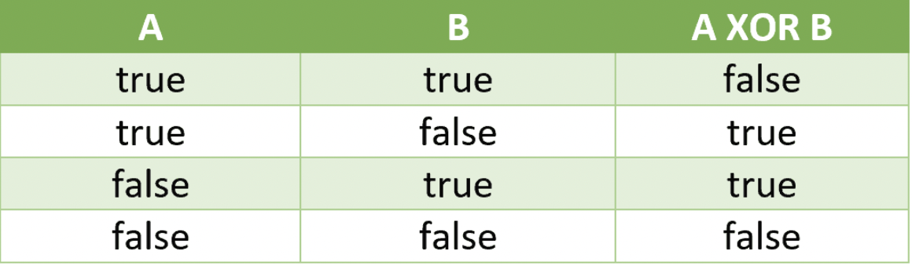

# Overview

### XOR

XOR operator is mainly used for bit wise operations.

Truth table( If both different then true, otherwise false)

XOR = (A AND !B) OR (!A AND B)

**Key Points:**

1. Operator in java: ^
2. a ^ a = 0
3. a ^ b = b ^ a
4. a ^ 0 = a

### **AND(&) (true of both true)**

### OR(|) (false if both false)

### COMPLEMENT(~) (negation)

### LEFT SHIFT(<< byHowMuch)

* Eg: 1<<1 = 2

### RIGHT SHIFT(>> byHowMuch)
